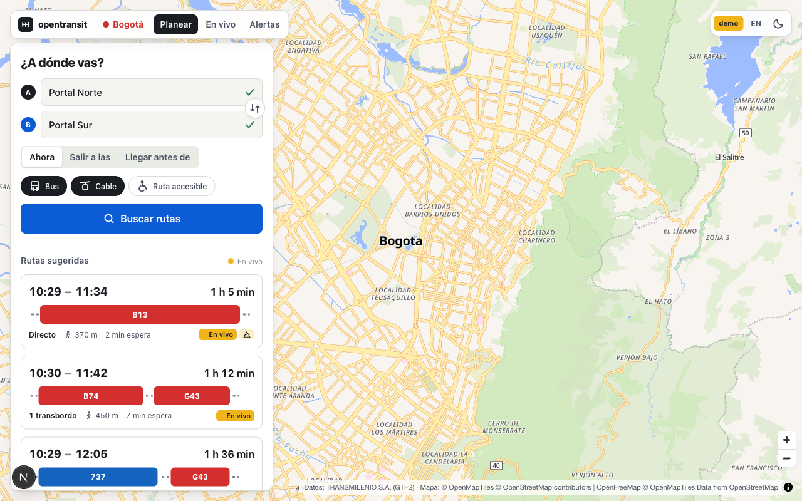
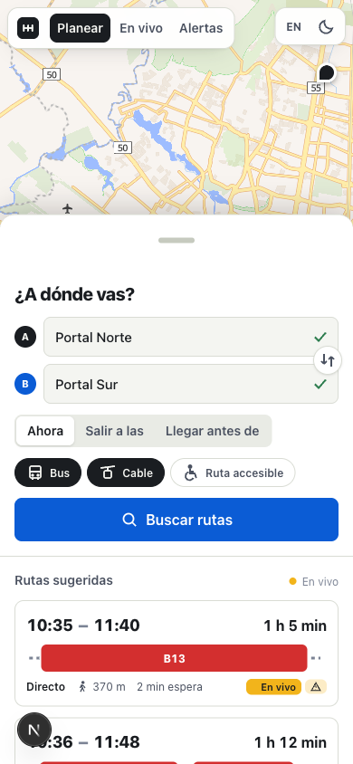
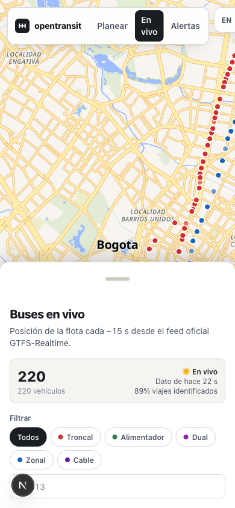

# opentransit-web

Web client of **opentransit**, an open-source, multi-city, multimodal trip planner.
Any city with a GTFS feed can run it with its own data and branding; Bogotá is the first tenant.

This repo is the browser UI only. It talks to [`opentransit-api`](../opentransit-api) and shares nothing
else with [`opentransit-mobile`](../opentransit-mobile) (Flutter) besides the API contract.

<p>
  
</p>
<p>
  
  
  
  
</p>

The shots above use mock data. `docs/screenshots/*-live-api.png` were taken against a running
`opentransit-api` with the live Bogotá GTFS + GTFS-Realtime feeds (5 real itineraries, ~5,900 buses on the stream).

## What it does

| Route | Screen |
|---|---|
| `/` | City picker (auto-redirects when the API serves one city) |
| `/{city}` | Map + planner: origin/destination with autocomplete, "use my location", pick on map, depart/arrive time, mode chips, accessible trips, itinerary cards, itinerary detail with leg timeline, walk directions, realtime badges and alerts; live buses on the itinerary's routes |
| `/{city}/stops/{stopId}` | Stop/station page with departures (auto-refresh every 20 s), routes, nearby stops |
| `/{city}/routes/{routeId}` | Route patterns on the map, stop list, live vehicles, alerts |
| `/{city}/live` | Whole fleet in real time (SSE stream with deltas), filter by component or route, click a bus for details |
| `/{city}/alerts` | Service alerts, most severe first |
| `/about` | Project, stack, data attribution |

Planner state lives in the URL (`?from=lat,lon&fromName=…&to=…&time=…&arriveBy=1&modes=…&wheelchair=1&it=0`),
so every plan is a shareable link. Spanish by default, English with one click. Light/dark theme. PWA manifest.

Nothing city-specific is hardcoded: name, colors, timezone, modes, feature flags and attribution come from the
`City` object the API returns. Bogotá only exists in the mock fixtures.

## Quickstart

```bash
pnpm install
cp .env.example .env.local

pnpm dev:mock     # realistic Bogotá fixtures, no backend needed → http://localhost:3000
pnpm dev          # against NEXT_PUBLIC_API_URL (default http://localhost:8001)
```

`pnpm build && pnpm start` for production, or `docker build -t opentransit-web .`
(pass `--build-arg NEXT_PUBLIC_API_URL=https://api.example.org`).

## Environment

| Variable | Default | Meaning |
|---|---|---|
| `NEXT_PUBLIC_API_URL` | `http://localhost:8001` | Base URL of opentransit-api, no trailing slash |
| `NEXT_PUBLIC_MOCK` | `0` | `1` serves fixtures from `src/mocks/` instead of calling the API |

Both are inlined at build time (they are `NEXT_PUBLIC_*`), so the Docker image bakes them in.

## Mock mode

`NEXT_PUBLIC_MOCK=1` swaps the fetch layer for `src/mocks/handlers.ts`, which answers every contract endpoint with
Bogotá-shaped data: 60 stops along the real Autopista Norte / Av. Caracas / NQS corridors, 12 routes, three
itineraries Portal Norte → Portal Sur (direct, one transfer, zonal + trunk), 220 vehicles that move along their
shapes every 4 s through the same SSE consumer the real stream uses, departures, and three alerts.
It's what CI builds against and what `pnpm screenshots` uses.

## How it talks to the API

- `src/lib/api/types.ts` mirrors the contract 1:1 (`docs/API.md` in the API repo). Treat it as read-only.
- `src/lib/api/client.ts` is the only place that knows about URLs; `hooks.ts` wraps it in React Query.
- `src/lib/api/stream.ts` consumes `/vehicles/stream`: first event is a full frame, then deltas
  (`updated` + `removed`) merged into a `Map`; reconnects with backoff; polls `/vehicles` if `EventSource` is missing.
- Errors arrive as `ApiRequestError` with the contract's `code`; the planner shows a dedicated state for `5xx`
  (router down) versus an empty result.

Known behaviour of the Bogotá feed the UI accounts for: fares are always `null` (shown as "not published"),
`realtime` is only true for the imminent arrival, `wheelchair` data is unreliable (flag shows "no data" when unknown).

## Map

MapLibre GL JS with OpenFreeMap vector tiles (`liberty` light, `dark` dark). No API key.
MapLibre ≥ 6 loads its worker relative to `import.meta.url`, which bundlers break, so
`scripts/copy-maplibre-worker.mjs` copies the worker into `public/vendor/maplibre/` on install/dev/build
and `MapView` calls `setWorkerUrl()`. Overlays are small components in `src/components/map/layers.tsx` that
re-add their sources when the basemap style reloads (theme switch).

## i18n

`src/lib/i18n/dict.ts` holds every UI string in `es` and `en`. Add both when you add copy.
`useI18n()` gives `t`, `lang`, `setLang`. The choice is remembered in `localStorage`.

## Scripts

| Command | What |
|---|---|
| `pnpm dev` / `pnpm dev:mock` | dev server (real API / fixtures) |
| `pnpm lint` · `pnpm typecheck` · `pnpm build` | what CI runs |
| `pnpm screenshots` | regenerate `docs/screenshots/` from a running `dev:mock` (needs `npx playwright install chromium`) |

## Contributing

See [CONTRIBUTING.md](CONTRIBUTING.md). MIT licensed.

Data: each city's transit agency (Bogotá: TRANSMILENIO S.A., GTFS). Map: © OpenMapTiles © OpenStreetMap contributors, tiles by OpenFreeMap.
