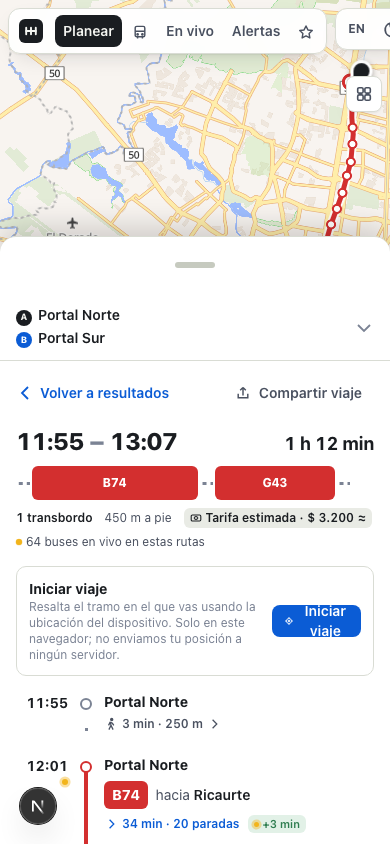
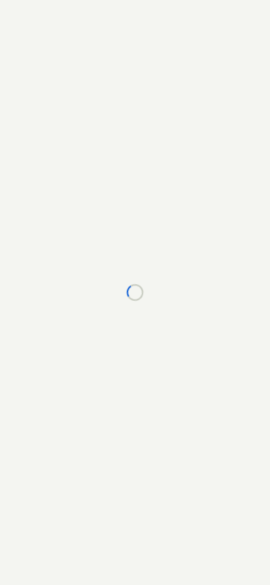

# opentransit-web

Web client of **opentransit**, an open-source, multi-city, multimodal trip planner.
Any city with a GTFS feed can run it with its own data and branding; Bogotá is the first tenant.

This repo is the browser UI only. It talks to [`opentransit-api`](../opentransit-api) and shares nothing
else with [`opentransit-mobile`](../opentransit-mobile) (Flutter) besides the API contract.

<p>
  
</p>
<p>
  
  
  
  
  
</p>
<p>
  
</p>

The shots above use mock data (`pnpm screenshots`). `docs/screenshots/*-live-api.png` are taken against a running
`opentransit-api` with the live Bogotá GTFS + GTFS-Realtime feeds.

## What it does

| Route | Screen |
|---|---|
| `/` | City picker (auto-redirects when the API serves one city) |
| `/{city}` | **Home hub** ("Hola, ¿qué quieres consultar?"): tiles for every module, Casa/Trabajo shortcuts, "mensajes de interés" carousel (severity-sorted, dismissible, capped impressions), nearby stations card, recent trips, agency services |
| `/{city}?view=plan` | **Planner**: origin/destination with nearby-first autocomplete, "use my location", pick on map, depart/arrive time, mode chips, accessible trips, "Llegar en bici a la estación", sorting chips (más rápido · menos transbordos · menos caminata · más económico · salida más próxima), itinerary cards with **Tarifa estimada**, itinerary detail with leg timeline, walk directions, live/scheduled badges, service-hours warnings, alerts, **Iniciar viaje** follow-along; live buses on the itinerary's routes, interpolated between frames |
| `/{city}/next` | **Ubica tu bus**: station → route → next buses, each row labeled En vivo / Por programación / Estimado, buses on the map tinted by ETA bucket (≤5 / ≤10 / ≤15 min) |
| `/{city}/stops/{stopId}` | **Arrival board** grouped by route ("Siguiente en 5 min · luego 10, 15 y 20"), freshness label, ETA-tinted buses heading here, routes, honest accessibility block ("dato no verificado" when the feed value is a blanket default), platforms, nearby stops, QR code, PQRS link, favorite star |
| `/{city}/routes` | Route finder by code or name, filtered by component, with service hours |
| `/{city}/routes/{routeId}` | Route patterns on the map, stop list, live vehicles, service window ("Fuera de horario · próximo 04:00"), alerts, QR code, favorite star |
| `/{city}/live` | Whole fleet in real time (SSE stream with deltas, interpolated motion), filter by component or route, `?stop=` tints buses by ETA to that stop, click a bus for details |
| `/{city}/favorites` | Casa, Trabajo and custom places, favorite stops with their next departures, favorite routes with service hours, recent trips — all local to the browser |
| `/{city}/alerts` | Service alerts, most severe first, with the agency's official PQRS channel |
| `/about` | Project, stack, data attribution |

Every map has a **Servicios** toggle (bike parking, toilets, ATMs, health points, libraries from `/pois`).
Component taxonomy (Troncal, Alimentador, Dual, Zonal, Cable…) with its icons and colors comes from `city.components`.
Remote config from `/v1/cities/{city}` drives poll intervals, feature flags (modules disappear from the nav and the hub),
and a maintenance banner. Deep links (`/{city}/stops/{id}`, `/{city}/routes/{id}`, `/{city}/plan…`) are the canonical
URLs printed in the QR codes; the mobile app claims them as App Links.

Where these ideas come from: the v1.1 feature plan in `../ROADMAP-v1.1.md` (TransMi App and Maas by Vettica, analysed in `../REFERENCE-APPS.md`).

Planner state lives in the URL (`?from=lat,lon&fromName=…&to=…&time=…&arriveBy=1&modes=…&wheelchair=1&bike=1&it=0&view=plan`),
so every plan is a shareable link. Spanish by default, English with one click. Light/dark theme. PWA manifest.

Nothing city-specific is hardcoded: name, colors, timezone, modes, feature flags and attribution come from the
`City` object the API returns. Bogotá only exists in the mock fixtures.

## Quickstart

```bash
pnpm install
cp .env.example .env.local

pnpm dev:mock     # realistic Bogotá fixtures, no backend needed → http://localhost:3000
pnpm dev          # against NEXT_PUBLIC_API_URL (default http://localhost:8001)
# if 3000 is taken: pnpm dev:mock -p 3100
```

`pnpm build && pnpm start` for production, or `docker build -t opentransit-web .`
(pass `--build-arg NEXT_PUBLIC_API_URL=https://api.example.org`).

## Environment

| Variable | Default | Meaning |
|---|---|---|
| `NEXT_PUBLIC_API_URL` | `http://localhost:8001` | Base URL of opentransit-api, no trailing slash |
| `NEXT_PUBLIC_MOCK` | `0` | `1` serves fixtures from `src/mocks/` instead of calling the API |

Both are inlined at build time (they are `NEXT_PUBLIC_*`), so the Docker image bakes them in.

## Mock mode

`NEXT_PUBLIC_MOCK=1` swaps the fetch layer for `src/mocks/handlers.ts`, which answers every contract endpoint with
Bogotá-shaped data: 60 stops along the real Autopista Norte / Av. Caracas / NQS corridors, 12 routes, three
itineraries Portal Norte → Portal Sur (direct, one transfer, zonal + trunk) with estimated fares, 220 vehicles that
move along their shapes every 4 s through the same SSE consumer the real stream uses, departures, the v1.1 arrival
board and "next buses" endpoints, station POIs, service windows, accessibility flags, remote config and three alerts.
It's what CI builds against and what `pnpm screenshots` uses (`BASE_URL=http://localhost:3100 pnpm screenshots`).

## How it talks to the API

- `src/lib/api/types.ts` mirrors the contract 1:1 (`docs/API.md` in the API repo). Treat it as read-only.
- `src/lib/api/client.ts` is the only place that knows about URLs; `hooks.ts` wraps it in React Query.
- `src/lib/api/stream.ts` consumes `/vehicles/stream`: first event is a full frame, then deltas
  (`updated` + `removed`) merged into a `Map`; reconnects with backoff; polls `/vehicles` if `EventSource` is missing.
- Errors arrive as `ApiRequestError` with the contract's `code`; the planner shows a dedicated state for `5xx`
  (router down) versus an empty result.

Known behaviour of the Bogotá feed the UI accounts for: fares are always `null` (shown as "not published"),
`realtime` is only true for the imminent arrival, `wheelchair` data is unreliable (flag shows "no data" when unknown).

## Map

MapLibre GL JS with OpenFreeMap vector tiles (`liberty` light, `dark` dark). No API key.
MapLibre ≥ 6 loads its worker relative to `import.meta.url`, which bundlers break, so
`scripts/copy-maplibre-worker.mjs` copies the worker into `public/vendor/maplibre/` on install/dev/build
and `MapView` calls `setWorkerUrl()`. Overlays are small components in `src/components/map/layers.tsx` that
re-add their sources when the basemap style reloads (theme switch).

## i18n

`src/lib/i18n/dict.ts` holds every UI string in `es` and `en`. Add both when you add copy.
`useI18n()` gives `t`, `lang`, `setLang`. The choice is remembered in `localStorage`.

## Scripts

| Command | What |
|---|---|
| `pnpm dev` / `pnpm dev:mock` | dev server (real API / fixtures) |
| `pnpm lint` · `pnpm typecheck` · `pnpm build` | what CI runs |
| `pnpm screenshots` | regenerate `docs/screenshots/` from a running `dev:mock` (needs `npx playwright install chromium`) |

## Contributing

See [CONTRIBUTING.md](CONTRIBUTING.md). MIT licensed.

Data: each city's transit agency (Bogotá: TRANSMILENIO S.A., GTFS). Map: © OpenMapTiles © OpenStreetMap contributors, tiles by OpenFreeMap.
